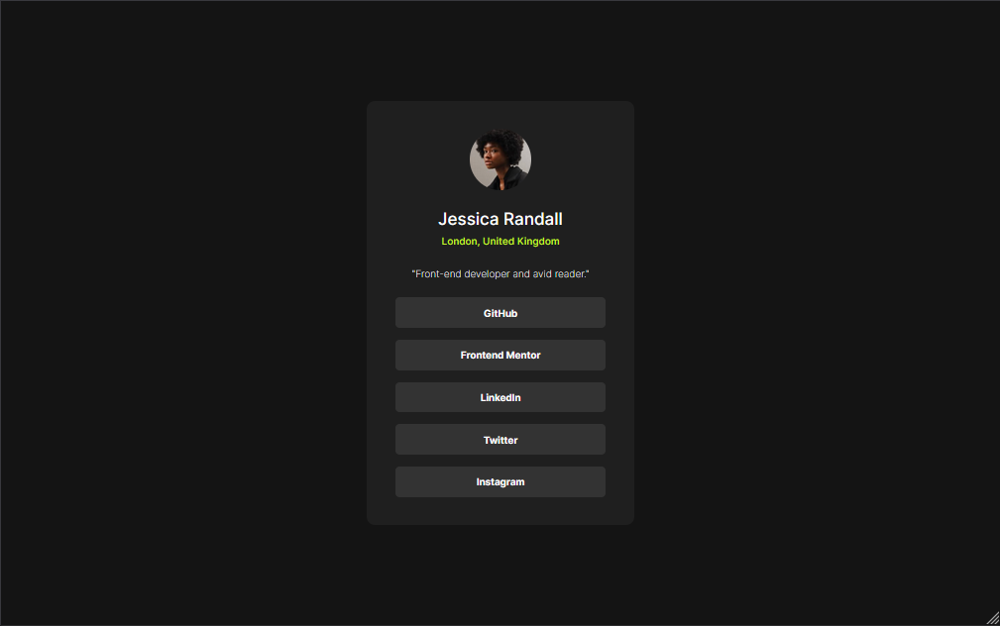

# Frontend Mentor - SOcial Links Profile solution

## Overview

### Screenshot

### Links

- Solution URL: [solution URL here](https://github.com/AgredaLuis/social-links-profile)
- Live Site URL: [live site URL here](https://agredaluis.github.io/social-links-profile/)

## My process

### Built with

- Semantic HTML5 markup
- CSS custom properties
- Mobile-first workflow
- TypeScript - JavaScript with Syntax for Types.
- [Vite](https://vitejs.dev/) - fast local development server
- [React](https://reactjs.org/) - JS library
- [Tailwind](https://tailwindcss.com//) - For styles

### Continued development

I'm going to keep doing these challenges until I have the confidence and practice to make good designs.

### Useful resources

- [Demystifying the Folder Structure of a React App](https://medium.com/swlh/demystifying-the-folder-structure-of-a-react-app-c60b29d90836) - This helped me to have a more understandable structure for when projects get long.

## Author

- Website - [Luis Agreda](https://luisagredadev.vercel.app/)
- Frontend Mentor - [@AgredaLuis](https://www.frontendmentor.io/profile/@AgredaLuis)
- Linkedin - [Luis Agreda](https://www.linkedin.com/in/luisagreda/)

